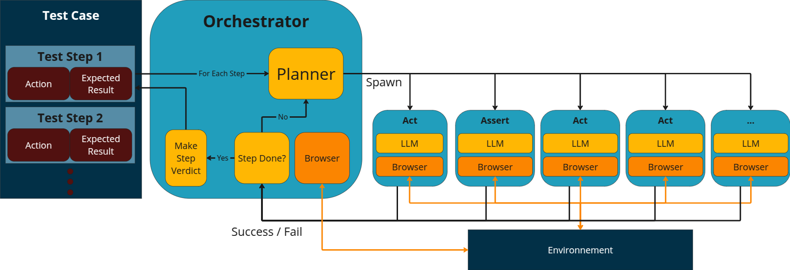

Implementation of an LLM-powered Autonomous Testing Agent (ATA), as presented in the paper _Are Autonomous Web Agents good testers?_

# Agent architecture

piñata is composed of three specialised components: the orchestrator, the actor, and the assertor.

The orchestrator oversees the entire process, delegating action execution to the actor and verification tasks to the assertor.

According to the four modules architecture, the orchestrator corresponds to the planning module, while the actor and assertor together form the action module. They all share a global memory module and further have a similar profile module.

The orchestrator is leading the process employing a Planning with Feedback strategy (Wang et al., 2024). It maintains a model of the test scenario and monitors its execution progress. At each step, it instructs the actor to perform the corresponding action. Based on the actor’s feedback, the orchestrator determines whether the action was successfully executed. If not, it requests a retry until either the action is completed or deemed unfeasible, in which case the test is marked as failed.

Once an action is executed, the orchestrator delegates the verification task to the assertor. Similarly, it evaluates the assertor’s feedback to determine whether the assertion was successfully performed. If necessary, it requests a retry. Depending on the outcome of the verification, the orchestrator either proceeds to the next step or concludes that the test has failed.

The actor, tasked with executing actions, identifies the relevant elements of the target application for the test action—an operation known as grounding, which remains a key challenge in AWA research (Chandu et al., 2021; Gu et al., 2023). Our implementation leverages the Set-Of-Marks technique (Yang et al., 2023) and uses the LLM’s capability to determine X and Y coordinates from screenshots. The actor component uses the Playwright framework for interacting with the browser.

The assertor is responsible for performing verifications, employing the Agent as a Judge approach to harness the LLM’s evaluative capabilities (Zhuge et al., 2024). Our implementation asks the LLM to perform an evaluation just by analysing the screenshot of the application.

All three components (orchestrator, actor, and assertor) share a global memory system that follows a long-term memory approach for the memory module (Zhang et al., 2024), storing all processed information. Notably, the system does not retrieve external data from the internet; it relies solely on observations of the target application.

Finally, all three agents share a similar profile module, presenting themselves as part of a multi-agent system while clearly defining their specific roles.



# Install

First install uv, installation details [here](https://docs.astral.sh/uv/getting-started/installation/).

1. Download dependencies

```bash
uv sync
```

2. Install playwright's chromium driver

```shell
uv run playwright install chromium
```

# Tests

To run the unit test cases:

```shell
uv run pytest -m "not llm"
```

If you want to run a single file:

```shell
uv run pytest ./tests/test_actor.py -m "not llm"
```

The -m flag allows you to filter out certain test cases based on their mark.
We have marked as "llm" the test cases that involve a actual LLM call.
LLM test cases are integration/system test cases, we deliberately ignore them when running unit tests.
To run them:

```shell
uv run pytest ./tests/test_actor.py -ms "llm"
```

For integration tests we use the -s flag that prints output in real time and regardless of the test case outcome.

# Run

Execute the _run.py_ file with the appropriate parameters:

- -f: path to JSON file containing the test case
- -p: provider for the llm service (supported: "openai", "anthropic", "google", "mistral", "openrouter", default: "openai")

Example:

```bash
uv run python run.py -f test_case.json -p google
```

The expected JSON format for a test case is as follows:

```json
{
  "name": "test case name",
  "url": "website url"
  "actions": [
    {
      "action": "action 1",
      "expectedResult": "assertion 1"
    },
    {
      "action": "action 2",
      "expectedResult": "assertion 2"
    },
  ]
}
```

# Benchmark

To run the benchmark presented in the paper, execute the _evaluation.py_ file with the appropriate parameters:

- -f: path to csv file with test cases
- -o: output folder for the test case verdict, playwright trace, screenshots, and execution logs
- -u: url of the application to be evaluated (default: http://www.vtaas-benchmark.com:9980)
- -p: provider for the llm service (supported: "openai", "anthropic", "google", "mistral", "openrouter", default: "openai")

### Classified

`uv run python evaluation.py -f "./benchmark/classifieds_passing.csv" -o "./results/openai/classifieds/passing" -u http://www.vtaas-benchmark.com:9980`

`uv run python evaluation.py -f "./benchmark/classifieds_failing.csv" -o "./results/openai/classifieds/failing" -u http://www.vtaas-benchmark.com:9980`

### OneStopShop

`uv run python evaluation.py -f "./benchmark/onestopshop_passing.csv" -o "./results/openai/onestopshop/passing" -u http://www.vtaas-benchmark.com:7770`

`uv run python evaluation.py -f "./benchmark/onestopshop_failing.csv" -o "./results/openai/onestopshop/failing" -u http://www.vtaas-benchmark.com:7770`

### Postmill

`uv run python evaluation.py -f "./benchmark/postmill_passing.csv" -o "./results/openai/postmill/passing" -u http://www.vtaas-benchmark.com:9999`

`uv run python evaluation.py -f "./benchmark/postmill_failing.csv" -o "./results/openai/postmill/failing" -u http://www.vtaas-benchmark.com:9999`

# Cite our work

```bibtex
@misc{ChevrVFBL25,
title = {Are {{Autonomous Web Agents Good Testers}}?},
author = {Chevrot, Antoine and Vernotte, Alexandre and Falleri, Jean-R{\'e}my and Blanc, Xavier and Legeard, Bruno},
year = {2025},
doi = {10.48550/arXiv.2504.01495},
url = {https://arxiv.org/abs/2504.01495}
}
```
